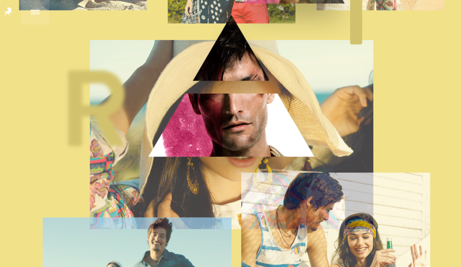
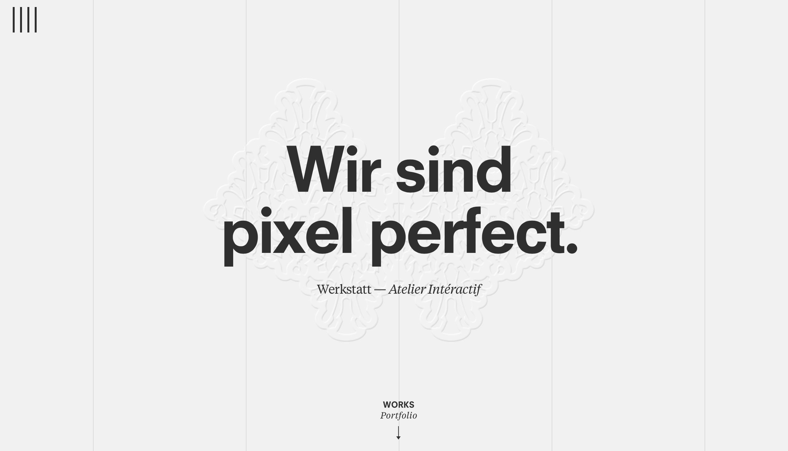
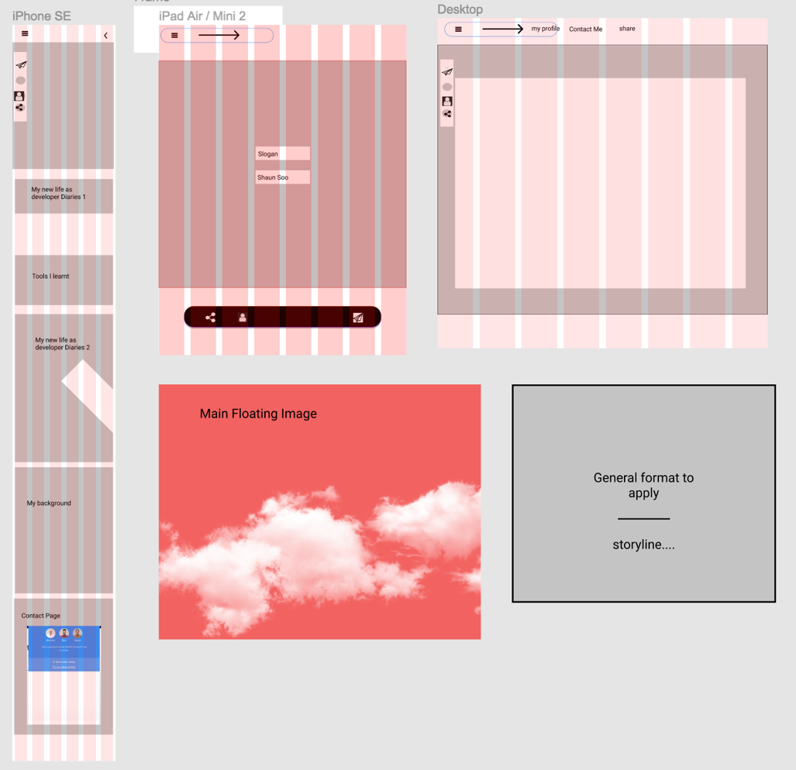
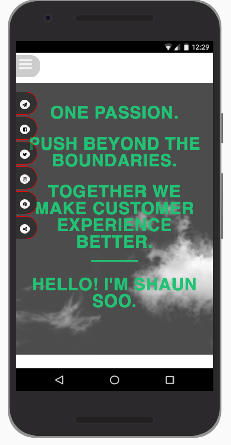
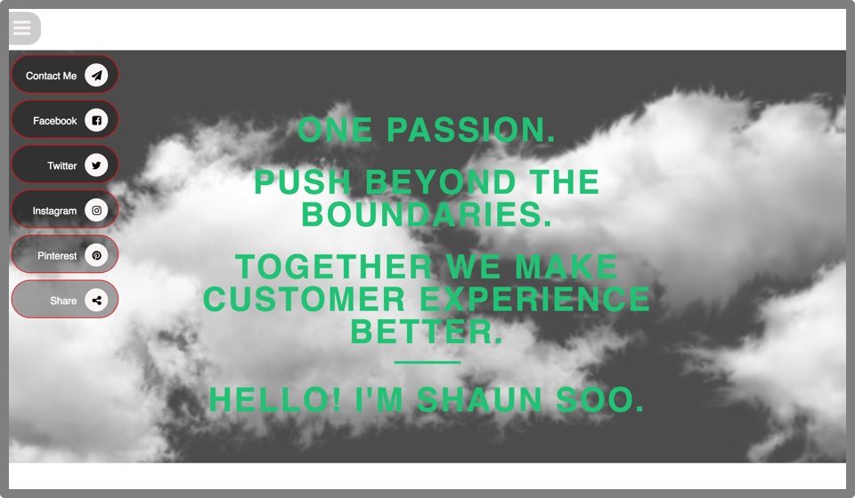
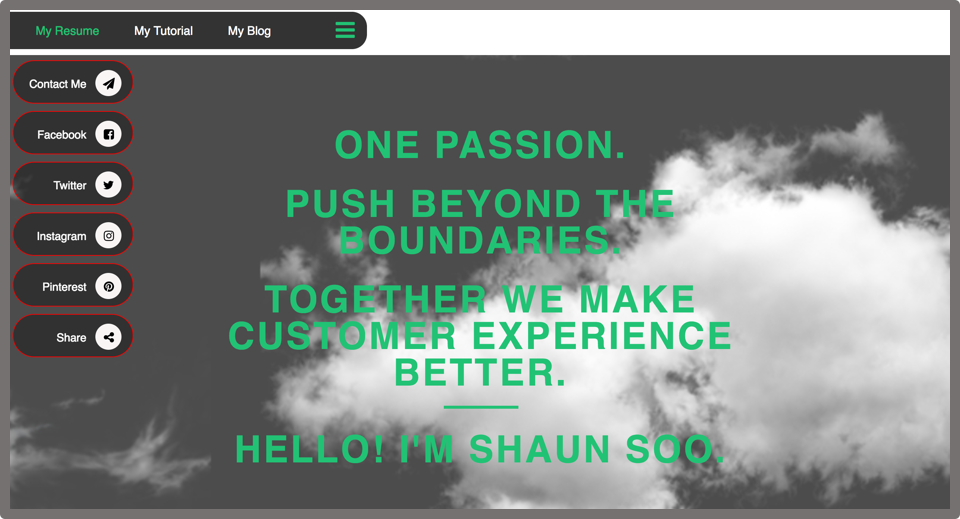
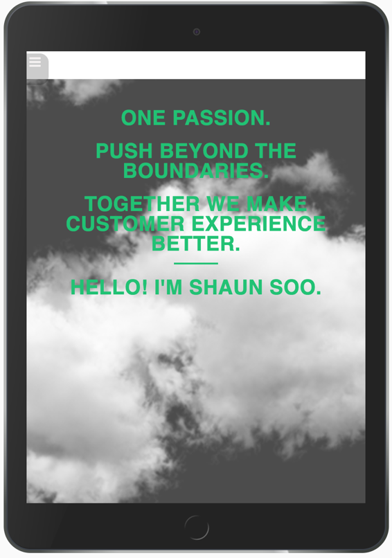
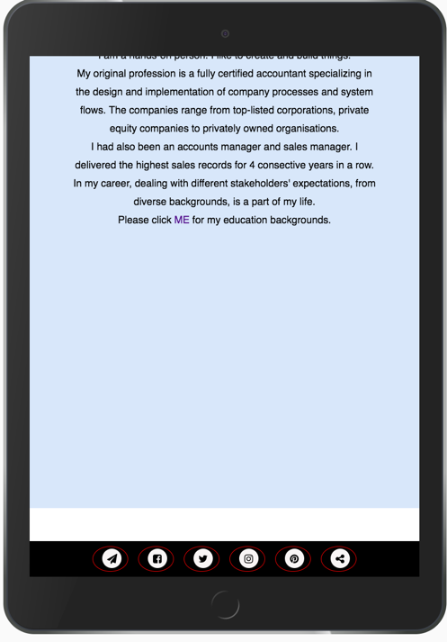

# My Web Story
---------------------------------------------------------
# Contents

1.0 Objective
2.0 Design
3.0 Inspiration
4.0 Wireframes
5.0 Code
6.0 Finished product

---------------------------------------------------------

## 1.0 Objective
I want to create a web page of my story telling of personality. I am creative in remix the existing knowledges using the fundamental tools CSS and HTML. This illustrates my understanding of capable to transform the challenge into product.

To be a story designer. What are the top questions your audiences, the employer, asks? 

---------------------------------------------------------

## 2.0 Design
I like to create design that is simple but with some creative features. I will use 

## 2.1 Symbol 
As a point of easy reference and engagement/communication.

## 2.2 Colour
Pastel colour to enhance the contents.
I felt that the tone of the colour is pleasing and approachable personality. It’s also delightful and emotionally empowering.

---------------------------------------------------------

## 3.0 Inspiration

I found some websites which are simple

http://www.loisjeans.com/es/ss2015/campaign

https://www.werkstatt.fr/home

---------------------------------------------------------

## 4.0 Wireframes
I use couple of tools in my wireframes, 
1.>	pen and paper (for immediate access when idea comes and brainstorming)
2.>	and then transfer into Figma.

The thought process: -

1.>	Simplicity is the centre of the design.
2.>	Features based on mobile design. Parallax design has been a popular trend. However, it may not work well in mobile. Therefore, parallax is not part of the main considerations.
3.>	Use icon as a communication tool making sure it is commonly understood visual language.
4.>	Using different colours tone of the below contents/theme to create different feelings to people knowing where they are now in the same webpage.
5.>	Decide not to go with logo at this stage.
6.>	Go with three different screen sizes: mobile, tablet and desktop therefore with three different features but with the same design and contents.

## Contents: -

1.>	The slogan.
2.>	The diary of a developer part 1.
3.>	What tools I used.
4.>	The diary of a developer part 2.
5.>	About the author.

https://www.figma.com/file/HZly7ztOGIrLJakOwBbKX8to/my-first-figma-design

---------------------------------------------------------

## 5.0 Code

I want to create my first webpage purely using HTML and CSS. I will use CSS to replace any JavaScript that was in use. I will not use any library nor frameworks to create the results. I will recode the websites and concepts that I liked. I was learning whilst I made my collections. I have kept some collections under my aspiration sections.

## 6.0 Finished product

https://shaun-profile.netlify.com/

## 6.1 Mobile view

## 6.2 Desktop

## 6.3 Tablet

---------------------------------------------------------

###Point of reference: https://github.com/paigerichards/paigerichards.github.io

